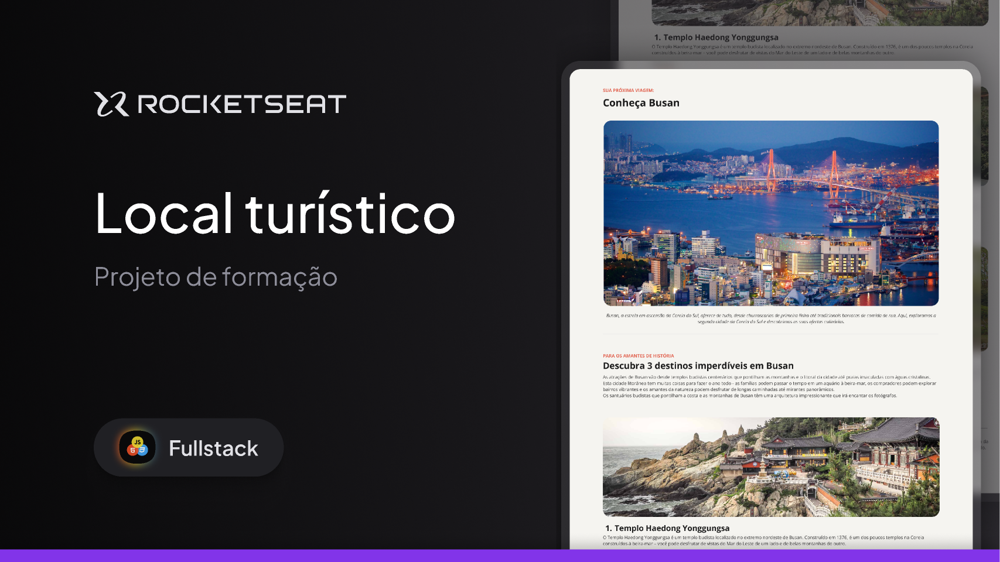

# LOCAL-TURISTICO - PROJETO DE FORMACAO ROCKETSEAT



Este é o README do projeto **Nome do Projeto**. O objetivo deste projeto é [descrever o objetivo do projeto]. A seguir você encontrará informações sobre como configurar, usar e contribuir para este projeto.

## Índice

1. [Descrição](#descrição)
2. [Tecnologias Utilizadas](#tecnologias-utilizadas)
3. [Instalação](#instalação)
4. [Como Usar](#como-usar)
5. [Contribuição](#contribuição)
6. [Licença](#licença)

## Descrição

[Este projeto é um **Guia Turístico Online FRONT-END**. Ele fornece informações completas sobre destinos turísticos, atrações, hotéis, restaurantes, atividades e outros pontos de interesse em diversas cidades e regiões. O site permite que os usuários explorem diferentes opções de turismo, leiam resenhas de outros viajantes, consultem fotos e consigam informações úteis sobre os locais de visitação, como horários de funcionamento, preços e recomendações.
O objetivo é oferecer uma plataforma prática e interativa, ajudando turistas a planejar suas viagens com mais facilidade, além de permitir que eles compartilhem suas próprias experiências e dicas para outros viajantes. O site também oferece a possibilidade de reservar passeios, hotéis e restaurantes diretamente pela plataforma..]

## Tecnologias Utilizadas

- **HTML**: 
- **CSS**: 
- **GIT**: 

## Instalação

Para rodar este projeto localmente, siga os passos abaixo:

1. Clone o repositório:

```bash
git clone https://github.com/seuusuario/nome-do-projeto.git
```

```bash
2. Navegue ate o index.html
cd nome-do-projeto
*use o live reload*

```

## Contribuição
1. Se você deseja contribuir para este projeto, siga os passos abaixo:

2. Fork o repositório.
3. Crie uma branch para sua feature: ```bash git checkout -b minha-feature```
4. Commit suas alterações: ```bash git commit -am 'Adicionando uma nova feature'```
Push para a branch: ```bash git push origin minha-feature```
5. Abra um Pull Request.


## Licença

